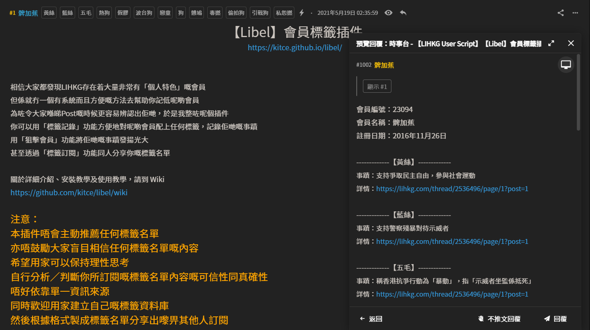

# Libel

Label users on [LIHKG](https://lihkg.com/)



***

## Wiki

For the installation steps, usage and more details, please visit [Wiki](https://github.com/kitce/libel/wiki).  
關於詳細介紹、安裝教學及使用教學，請閱讀 [Wiki](https://github.com/kitce/libel/wiki)。

***

## Introduction

This project is derived from my previous LIHKG userscript project [**LIHKG Label Users**](https://gist.github.com/kitce/c7fe972b1657120919f0fb05047569ba).

In view of the features that I want to add being more and more, it is not easy to keep developing on the previous project codebase, so I decided to rewrite it from scratch.

Pull requests are welcome.

***

## Development

### Install dependencies

```bash
$ yarn
```

For a smooth development experience, you may want to execute the following commands simultaneously:

### Build

```bash
$ yarn dev
```

When `webpack-dev-server` completed the first compilation, follow these steps to test on [LIHKG](https://lihkg.com/):

1. Install [Tampermonkey](https://www.tampermonkey.net/)
2. Visit [http://localhost:8080/libel.proxy.user.js](http://localhost:8080/libel.proxy.user.js)
3. Click **Install** / **Reinstall**
4. Go back to [LIHKG](https://lihkg.com/) and reload the page

Whenever you made changes and `webpack-dev-server` recompiled the files, repeat step 2 to 4.

### SCSS module typings

```bash
$ yarn type:scss
# or
$ yarn type:scss:watch
```

### Mock data

```bash
$ yarn mock
```

#### Why the mock data is hosted on port `20630`?

To memorize [the death of Hong Kong](https://en.wikipedia.org/wiki/Hong_Kong_national_security_law) on 30/6/2020

***

## Distribution

### Build

```bash
yarn build
```

Distributable files will be available in [`/dist`](https://github.com/kitce/libel/tree/master/dist)

***

## Disclaimer

This project only provides technical support for the [features](https://github.com/kitce/libel/wiki#%E5%8A%9F%E8%83%BD). The owner and contributors do not assume any legal responsibilities caused by the users. Users should be aware of and take the risks.

***

## License

MIT License
