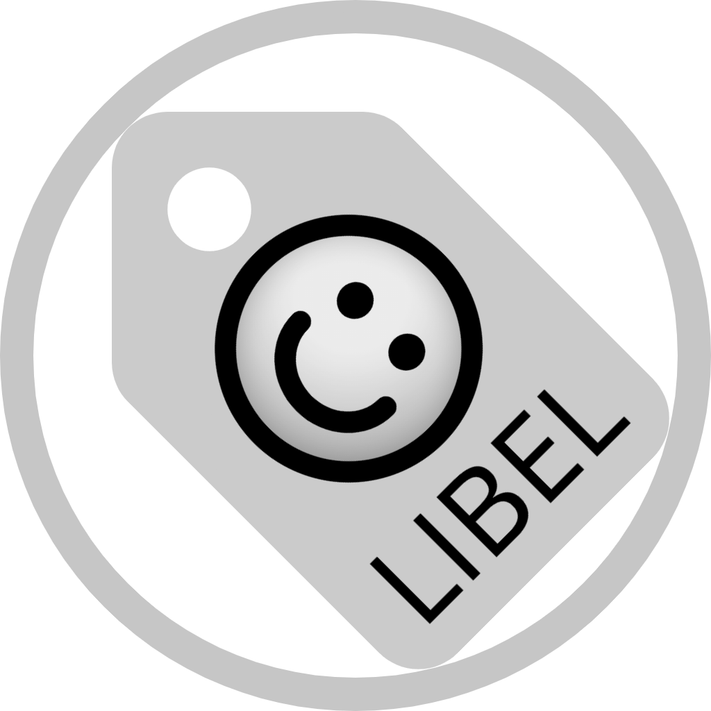
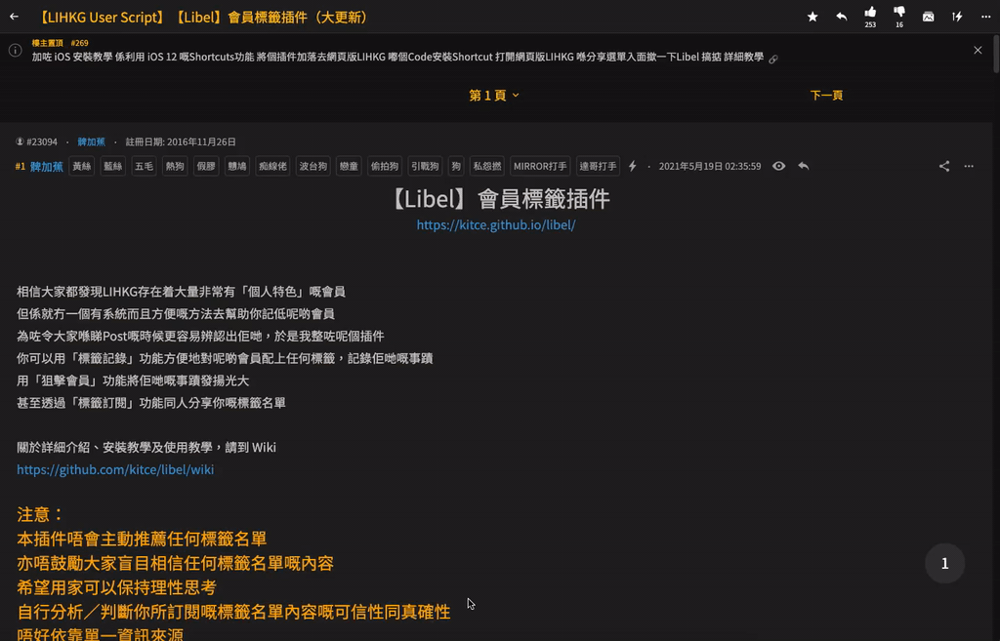

<p align="center">
  
  <h1 align="center">Libel</h1>
  <p align="center">Label users on LIHKG</p>
  <p align="center">
    
  </p>
</p>

***

## Installation / Usage

For the installation steps, usage and more details, please visit [Wiki](https://github.com/kitce/libel/wiki).

關於詳細介紹、安裝教學及使用教學，請閱讀 [Wiki](https://github.com/kitce/libel/wiki)。

***

## Development

*This section is for developers only.*

*此章節只供開發者瀏覽。*

### Install dependencies

```bash
pnpm install
```

For a smooth development experience, you may want to execute the following commands simultaneously:

### Start development server

```bash
pnpm dev:main
```

### SCSS module typings

```bash
pnpm type:scss[:watch]
```

### Install development build

1. Start the development server
2. Install [Tampermonkey](https://www.tampermonkey.net/) (or your favourite userscript manager)
3. Visit [http://localhost:8080/libel.proxy.user.js](http://localhost:8080/libel.proxy.user.js)
4. Click **Install**
5. Go back to [LIHKG](https://lihkg.com/) and reload the page

Whenever a file has changed, `webpack-dev-server` will recompile the code, and you can simply reload the page to see the changes.

***

## Distribution

### Build

```bash
pnpm build
```

The distributable files will be available in [`/dist`](https://github.com/kitce/libel/tree/master/dist)

***

## Disclaimer

This project only provides technical support for the [features](https://github.com/kitce/libel/wiki#%E5%8A%9F%E8%83%BD). The owner and contributors do not assume any legal responsibilities caused by the users. Users should be aware of and take the risks.

***

## Privacy Policy

[Privacy Policy](https://github.com/kitce/libel/wiki/%E7%A7%81%E9%9A%B1%E6%94%BF%E7%AD%96)

***

## License

MIT License
